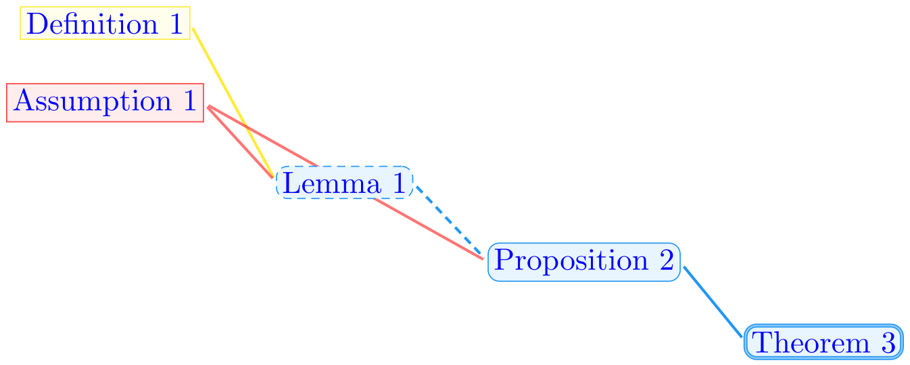
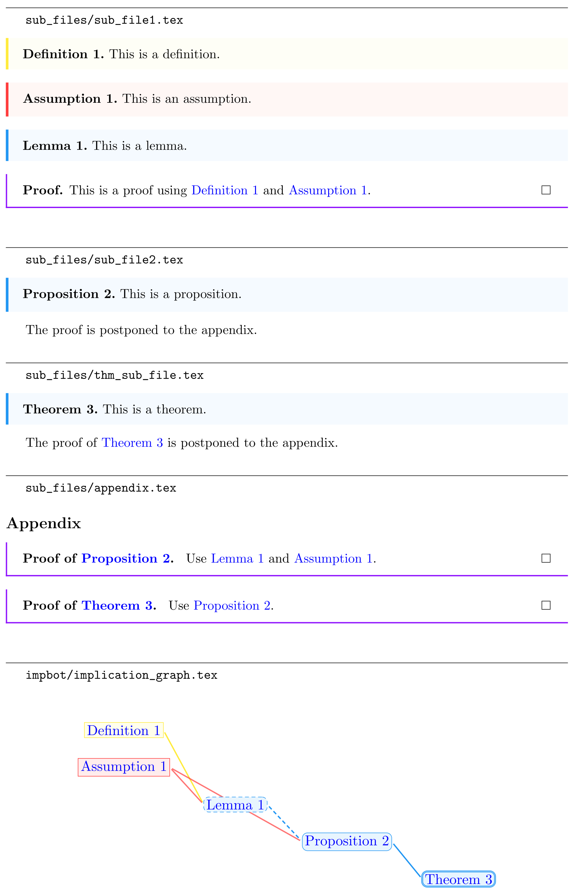

# `impbot`: automatic implication graph for LaTeX projects



`impbot` reads a main `.tex` file and looks for logical propositions (LaTeX environments for definitions, theorems etc), then draws a TikZ graph representing which proposition logically depends on which.

The implication dependency is parsed by looking at which propositions are referenced (e.g. using `\Cref`) within the statement and proof of the proposition.

## Installation

Clone the repository, navigate inside, then install the python package with `pip`:

```bash
git clone https://github.com/eloitanguy/impbot.git
cd impbot
pip install .
```

## Workflow

#### First execution

To run the script, use the command:

```bash
impbot <path_to_main_tex_file>
```

This will create a folder `impbot/` next to the main tex file, with the following structure:

```
<main_tex_file>
impbot/
│   impbot_cfg.yaml
│   impbot_requirements.tex
|   implication_graph.tex
└───
```

- `impbot_cfg.yaml` is a configuration file you can edit to give instructions to `impbot` for future executions. See the explanations in the comments of the [default config file](impbot/impbot_default_cfg.yaml).

- `impbot_requirements.tex` is a header file you should input in your main `.tex` file to make sure that LaTeX loads the appropriate packages and options.

- `implication_graph.tex` defines a TikZ figure representing your graph that you can input in your main `.tex` file.

Note that `impbot_requirements.tex` and `implication_graph.tex` are **over-written** each time `impbot` is ran, so edit them with caution.

#### Graph or configuration update

If you want to update your graph (because your project has changed or because you modified `impbot_cfg.yaml`), you can update `implication_graph.tex` by running

```bash
impbot <path_to_main_tex_file>
```

again, then compiling your LaTeX project.

Note that if any file in `impbot/` is missing, `impbot` will replace them. In particular, to reset the configuration, you can delete `impbot_cfg.yaml`.

## Example

Below is an example of the output produced when running `impbot` on [an example LaTeX project](example/)


